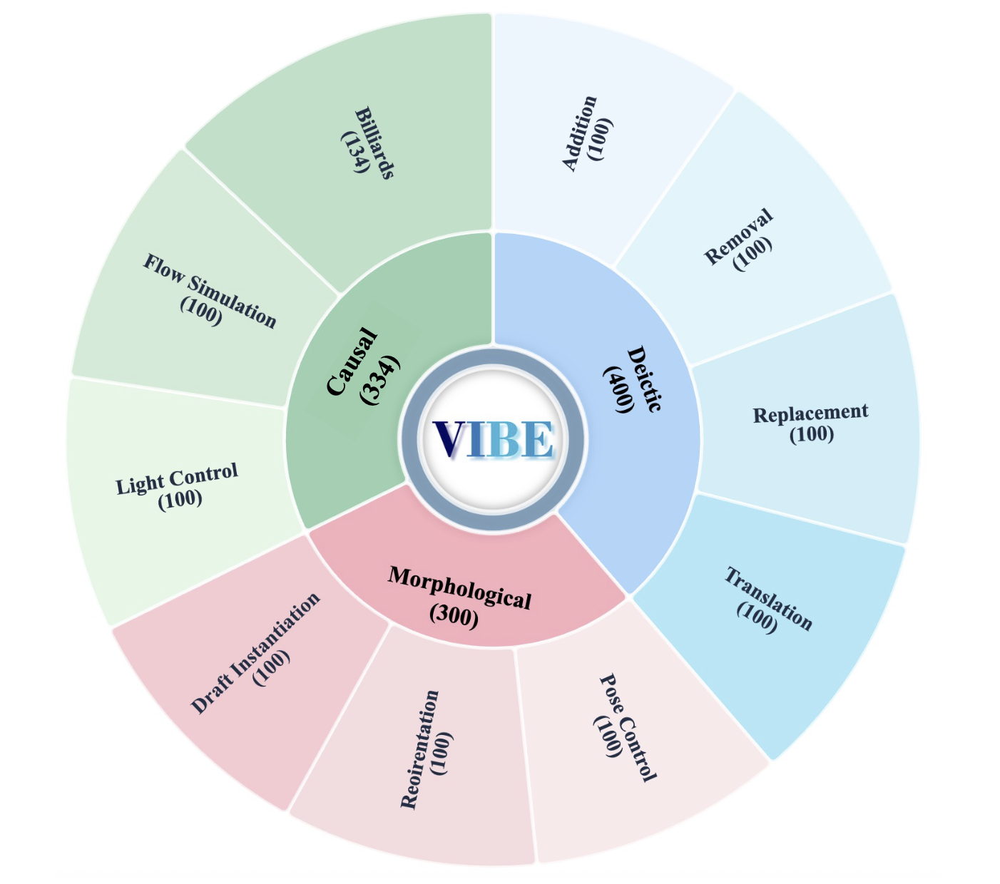
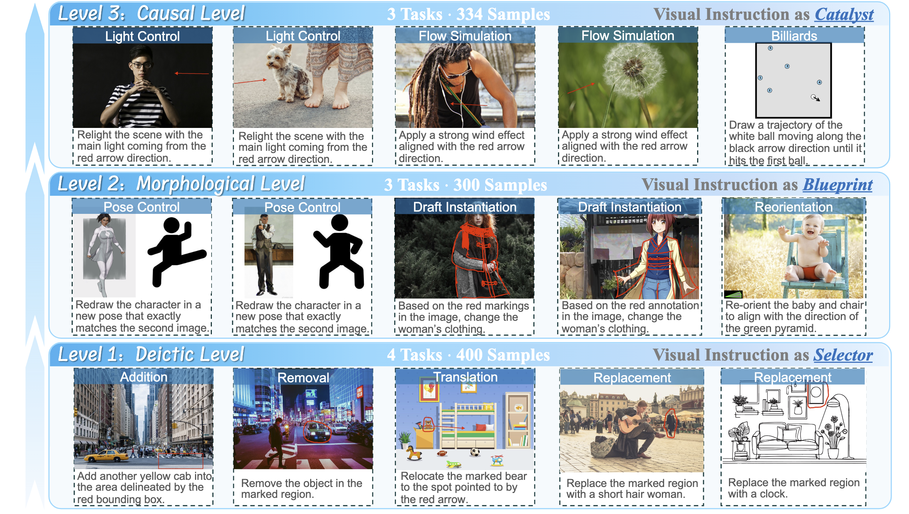

# *How Well Do Models Follow Visual Instructions?* VIBE: A Systematic Benchmark for Visual Instruction-Driven Image Editing

[](https://arxiv.org/) [](https://) [](./LICENSE)  [](https://github.com/hwanyu112/VIBE-Benchmark/stargazers)  

<font size=7><div align='center' > [[🖥 Project Page](https://vibe-benchmark.github.io/)] [[📖 arXiv Paper](https://arxiv.org/abs/2510.24514)] [[🤗 Dataset](https://huggingface.co/datasets/VIBE-Benchmark/VIBE-Benchmark)] [[🤗 Results](https://huggingface.co/collections/VIBE-Benchmark/vibe-model-results)]</div></font>

## 📖 Overview
<p align="center">
  
</p>
VIBE comprises 1,034 samples across 10 tasks, organized into a three-level hierarchy that reflects increasing interaction and reasoning complexity, from deictic grounding and morphological manipulation to causal reasoning.

### 📂 Benchmark Structure

<p align="center">
  
</p>

| Level | Role | Focus | Tasks |
| :--- | :--- | :--- | :--- |
| **Level 1: Deictic** | *Selector* | Spatial Grounding | Addition (AD), Removal (RM), Replacement (RP), Translation (TR)|
| **Level 2: Morphological** | *Blueprint* | Structural Constraints | Pose Control (PC), Reorientation (RO), Draft Instantiation (DI) |
| **Level 3: Causal** | *Catalyst* | Causal Reasoning | Light Control (LC), Flow Simulation (FS), Billiards (BI) |


## 🚀 Getting Started

### Prerequisites

- Python 3.8+

### Installation

1. Clone the repository:
```bash
git clone https://github.com/hwanyu112/VIBE-Benchmark.git
cd VIBE-Benchmark
```

2. Install dependencies:
```bash
pip install tqdm openai pillow
pip install -U "huggingface_hub"
```

3. Set up your API keys (if using GPT-5.1 for evaluation):
```bash
export OPENAI_API_KEY="your-api-key-here"
```

###  Dataset & Inference

#### 1. Download Dataset

Download the VIBE Benchmark dataset from [Hugging Face](https://huggingface.co/datasets/VIBE-Benchmark/VIBE-Benchmark):
```bash
hf download VIBE-Benchmark/VIBE-Benchmark --local-dir ./VIBE-Benchmark-Dataset --repo-type dataset
```

The directory structure should look like this:

```
VIBE-Benchmark-Dataset/
├── Tasks/
│   ├── Level-1-Deictic/
│   ├── Level-2-Morphological/
│   └── Level-3-Causal/
├── Common_Corpus/
│   ├── animation/
│   ├── real-world/
│   └── sketch/
```

#### 2. Run Inference (Example with GPT)

We provide `gpt.py` as an example script to run inference on the benchmark using OpenAI's editing models.

1. **Configure Paths**: Open `gpt.py` and update the `BASE_DIR` variable to point to your downloaded dataset location:
   ```python
   # In gpt.py
   BASE_DIR = "/path/to/your/VIBE-Benchmark-Dataset/"
   ```

2. **Set API Key**:
   ```bash
   export OPENAI_API_KEY="your-api-key"
   ```

3. **Run the Script**:
   By default, the script is configured to run the "Reorientation" task. You can modify the `target_task` variable in the `__main__` block to run other tasks.
   ```bash
   python gpt.py
   ```

   The script will generate images and save the results in corresponding task directories:
   `Tasks/{Level}/{TaskName}/{model_name}_run_v1/`

#### Data Structure

Organize your model results in the following structure to match `eval.sh`:

```
{your result directory}/
└── {model_name}/
    ├── Level-1-Deictic/
    │   ├── Addition/
    │   │   ├── Addition_results.json
    │   │   └── imgs/
    │   ├── Removal/
    │   ├── Replacement/
    │   └── Translation/
    ├── Level-2-Morphological/
    │   ├── Reorientation/
    │   ├── Draft_Instantiation/
    │   └── Pose_Control/
    └── Level-3-Causal/
        ├── Light_Control/
        ├── Flow_Simulation/
        └── Billiards/
```

Each `{task}_results.json` should follow this format (see this [example file](https://huggingface.co/datasets/VIBE-Benchmark/VIBE-Banana-Pro/blob/main/Dimension-I/Addition/Addition_results.json) for reference):
```json
[
  {
    "id": "Task_0001",
    "prompt": "Add a red ball to the scene",
    "saved_image_path": "imgs/sample_001.mp4"
  }
]
```

## 🔧 Evaluation

### Quick Evaluation

Configure your model name and results path in `eval.sh` :

```bash
# Set your model name
MODEL="your_model_name"

# Set results directory
BASE_RESULTS="/path/to/your/results"
```

Evaluate all 10 tasks for a model:

```bash
bash eval.sh
```

The script will:
1. Automatically iterate through all 10 tasks.
2. Evaluate each sample using task-specific prompts (supporting multiple repeats).
3. Update JSON files with detailed per-sample scores (e.g., `Addition_results_1.json`).
4. Generate an aggregated summary (`*_summary.json`) containing mean and variance for all metrics.
5. Save execution logs to the `logs/` directory.

## 🏆 Leaderboard

<p align="center">
  
</p>

## 📄 Citation

If you find VIBE useful in your research, please consider citing:

```bibtex
@article{vibe-benchmark,
  title={How Well Do Models Follow Visual Instructions? VIBE: A Systematic Benchmark for Visual Instruction-Driven Image Editing},
  author={Your Name and Others},
  journal={arXiv preprint},
  year={2026}
}
```

## 📜 License

The VIBE Benchmark, including the provided code, dataset images, and model result images, is available for **Academic Research Purposes Only**. Commercial usage is strictly prohibited.

The images in this dataset are collected from various sources. While we have made efforts to filter inappropriate content, if you find any image that infringes on your copyright or privacy, please contact the authors. We will take appropriate action to address valid concerns.

## 🙏 Acknowledgments

We thank the creators of the evaluation models and the open-source community for their valuable contributions.

## 📧 Contact

For questions or feedback, please open an issue or contact: [Huanyu Zhang](mailto:huanyu.zhang@cripac.ia.ac.cn)

## 🔗 Links

- [Paper](https://arxiv.org/abs/2510.24514)
- [Project Page](https://vibe-benchmark.github.io/)
- [Dataset Download](https://huggingface.co/datasets/VIBE-Benchmark/VIBE-Benchmark)